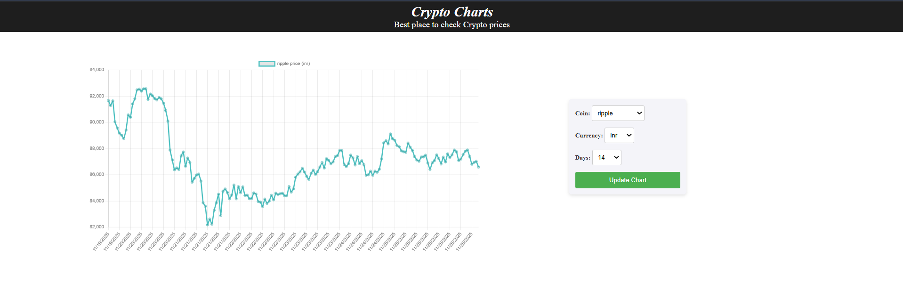

# 📊 Crypto Charts

Crypto Charts is a frontend web application that allows users to track the price evolution of cryptocurrencies over different time ranges and in multiple currencies.

---

## 🚀 Features

- View cryptocurrency price history (7 days, 30 days, etc.)
- Switch between currencies (USD, EUR)
- Select different cryptocurrencies (Bitcoin, Ethereum, etc.)
- Dynamic and interactive charts
- Real-time data fetched from external APIs

---

## 🛠 Technologies Used

- Angular 19
- HTML, SCSS
- REST APIs
- HTTPClient & RxJS
- Chart.js library for data visualization

---

## 📸 Screenshots

